# Strapi Component Mapping

This document describes names, locations, designs (screenshots) and some queries of React components that are invoked by Strapi components.

## Quick Menu

Accordion-Items

- [Flat text](#11-flat-text)
- [Institution](#12-institution)
- [InstitutionNarrow](#13-institutionnarrow)

Blocks

- [Blog Post Link](#21-block-post-link)
- [File](#22-file)
- [Footer Section](#23-footer-section)
- [Icon With Title And Description](#24-icon-with-title-and-description)
- [ListItem](#25-listitem)
- [Numerical List Item](#26-numerical-list-item)
- [Page Link](#27-page-link-needs-confirmation)
- [Subpage](#28-subpage)
- [Video](#29-video)

Sections

- [Strapi Component Mapping](#strapi-component-mapping)
  - [Quick Menu](#quick-menu)
  - [1. Accordion-Items](#1-accordion-items)
    - [1.1 Flat text](#11-flat-text)
    - [1.2 Institution](#12-institution)
    - [1.3 InstitutionNarrow](#13-institutionnarrow)
  - [2. Blocks](#2-blocks)
    - [2.1 Block Post Link](#21-block-post-link)
    - [2.2 File](#22-file)
    - [2.3 Footer Section](#23-footer-section)
    - [2.4 Icon With Title And Description](#24-icon-with-title-and-description)
    - [2.5 ListItem](#25-listitem)
    - [2.6 Numerical List Item](#26-numerical-list-item)
    - [2.7 Page Link (needs confirmation)](#27-page-link-needs-confirmation)
    - [2.8 Subpage](#28-subpage)
    - [2.9 Video](#29-video)
  - [3. Sections](#3-sections)
    - [3.1 Accordion](#31-accordion)
    - [3.2 Calculator](#32-calculator)
    - [3.3 Columned Text](#33-columned-text)
    - [3.4 Contact](#34-contact)
    - [3.5 Divider](#35-divider)
    - [3.6 File List](#36-file-list)
    - [3.7 Icon Title Desc](#37-icon-title-desc)
    - [3.8 Links](#38-links)
    - [3.9 List Items](#39-list-items)
    - [3.10 Narrow Text](#310-narrow-text)
    - [3.11 Newsletter](#311-newsletter)
    - [3.12 Numerical List](#312-numerical-list)
    - [3.13 Subpage List](#313-subpage-list)
    - [3.14 Text With Image](#314-text-with-image)
    - [3.15 Videos](#315-videos)
    - [3.16 Waves](#316-waves)
    - [3.17 Gallery](#317-Gallery)

## 1. Accordion-Items

### 1.1 Flat text

Name of React component: ?
Location: ?

> Renders inside Sections/[AccordionItem](#3.1-Accordion) probably as NarrowText component, maybe should one of them be renamed.

### 1.2 Institution

Name of React component: `Institution`

Location: `libs/ui/bratislava/src/components/Institution/Institution.tsx`
Screenshot:

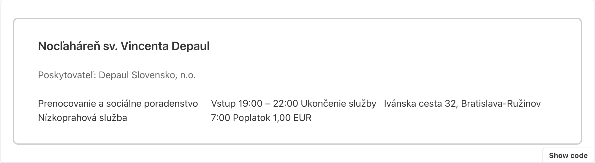

### 1.3 InstitutionNarrow

## 2. Blocks

### 2.1 Block Post Link

### 2.2 File

### 2.3 Footer Section

Name of React component: `FooterSection`

Location: `libs/ui/bratislava/src/components/FooterSection/FooterSection.tsx`
Screenshot:

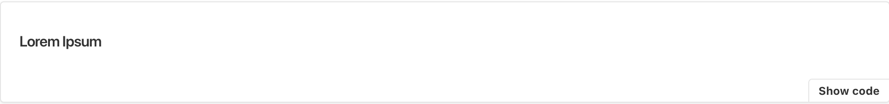

### 2.4 Icon With Title And Description

### 2.5 ListItem

Name of React component: `ListItem`
Location: `libs/ui/bratislava/src/components/ListItem/ListItem.tsx`
Screenshot:

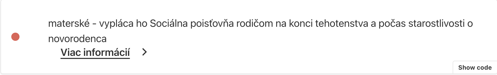

### 2.6 Numerical List Item

Name of React component: `NumericalListItem`
Location: `libs/ui/bratislava/src/components/NumericalListItem/NumericalListItem.tsx`
Screenshot:

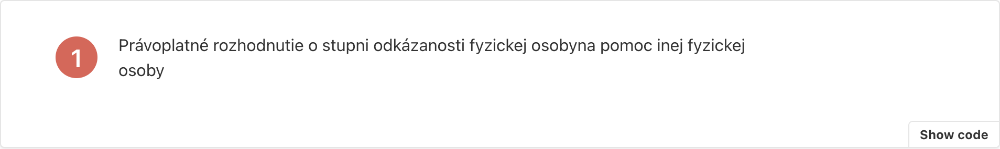

### 2.7 Page Link (needs confirmation)

Name of React component: `PageLinkButton`
Location: `libs/ui/bratislava/src/components/PageLinkButton/PageLinkButton.tsx`
Screenshot:

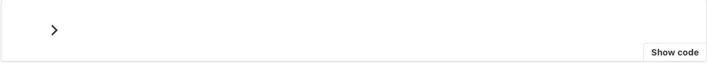

### 2.8 Subpage

Name of React component: `SubpageItem`
Location: `libs/ui/city-library/src/components/SubpageItem/SubpageItem.tsx`

### 2.9 Video

Name of React component: `Video`
Location: `libs/ui/bratislava/src/components/Videos/Videos.tsx`

## 3. Sections

### 3.1 Accordion

Name of React component: `AccordionItem`
Location: `libs/ui/bratislava/src/components/AccordionItem/AccordionItem.tsx`
Screenshot:

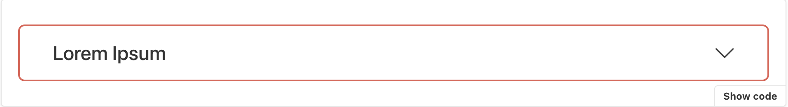

### 3.2 Calculator

Name of React component: `MinimumCalculator`
Location: `apps/next/homepage/components/molecules/sections/MinimumCalculator.tsx`

### 3.3 Columned Text

Name of React component: `ColumnedText`
Location: `libs/ui/bratislava/src/components/ColumnedText/ColumnedText.tsx`
Screenshot:

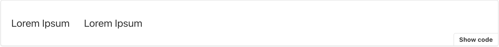

### 3.4 Contact

Name of React component: `Contact`
Location: `libs/ui/bratislava/src/components/Contact/Contact.tsx`
Screenshot:

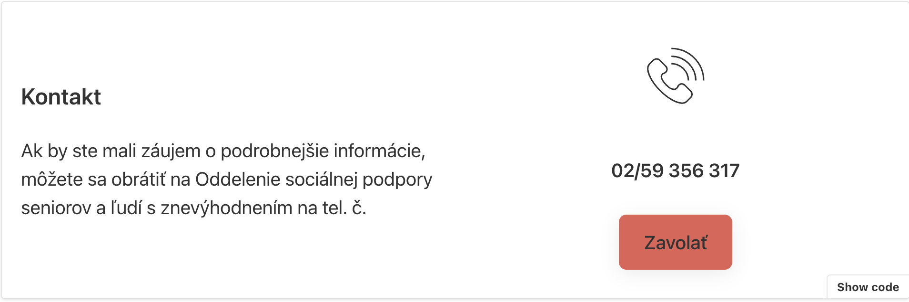

> Note: there are 6 variants of this component. See storybook for more details.

### 3.5 Divider

Name of React component: `Contact`
Location: `libs/ui/bratislava/src/components/Divider/Divider.tsx`
Screenshot:

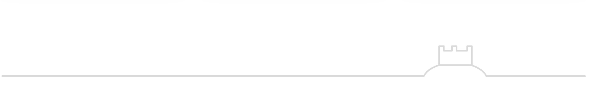

> Note: there are 22 variants of this component. See storybook for more details.

### 3.6 File List

Name of React component: `FileList`
Location: `libs/ui/bratislava/src/components/FileList/FileList.tsx`
Screenshot:

### 3.7 Icon Title Desc

Name of React component: `RentBenefits`
Location: `libs/ui/bratislava/src/components/Sections/RentBenefits/RentBenefits.tsx`

### 3.8 Links

Name of React component: `Links`
Location: `libs/ui/bratislava/src/components/Links/Links.tsx`
Screenshot:

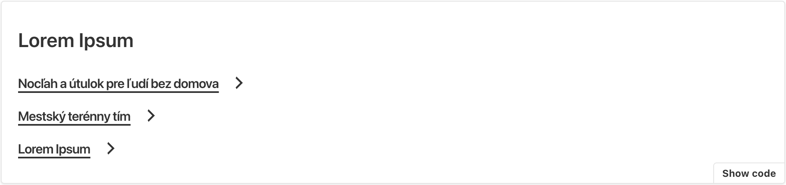

### 3.9 List Items

Name of React component: `ListItems`
Location: `libs/ui/bratislava/src/components/ListItems/ListItems.tsx`
Screenshot:

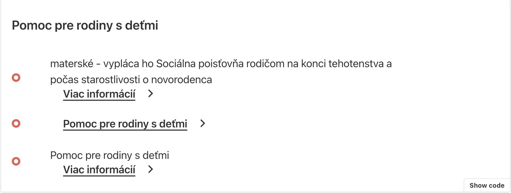

### 3.10 Narrow Text

Name of React component: `NarrowText`
Location: `libs/ui/bratislava/src/components/NarrowText/NarrowText.tsx`
Screenshot:

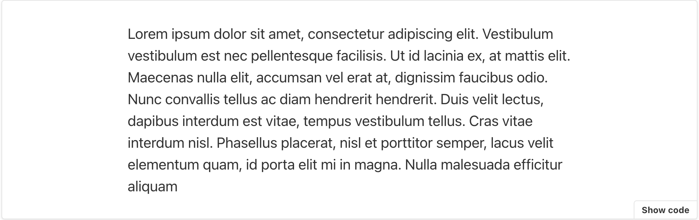

### 3.11 Newsletter

Name of React component: `NewsLetterSection`
Location: `apps/next/homepage/components/molecules/sections/NewsLetterSection.tsx`
Screenshot:

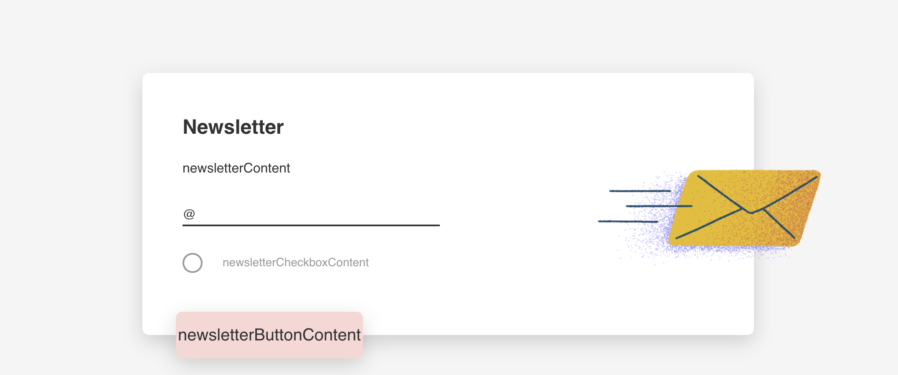

### 3.12 Numerical List

Name of React component: `NumericalList`
Location: `libs/ui/bratislava/src/components/NumericalList/NumericalList.tsx`
Screenshot:

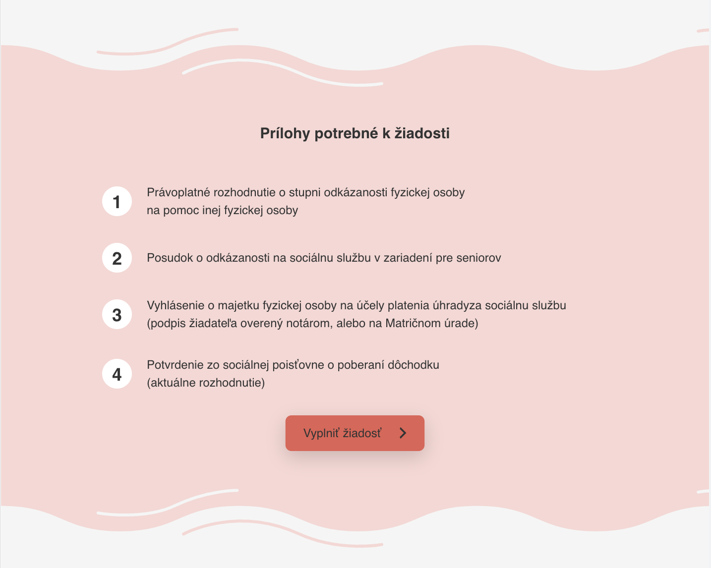

### 3.13 Subpage List

Name of React component: `SubpageList`
Location: `libs/ui/bratislava/src/components/SubpageList/SubpageList.tsx`
Screenshot:

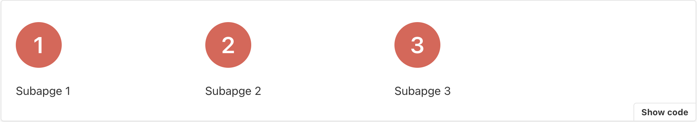

### 3.14 Text With Image

Name of React component: `TextWithImage`
Location: `libs/ui/bratislava/src/components/TextWithImage/TextWithImage.tsx`
Screenshot:

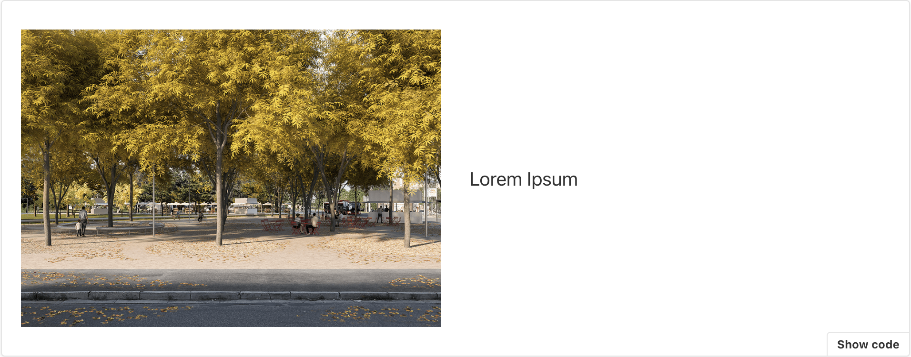

### 3.15 Videos

Name of React component: `Videos`
Location: `libs/ui/bratislava/src/components/Videos/Videos.tsx`

### 3.16 Waves

Name of React component: `Waves`
Location: `libs/ui/bratislava/src/components/Waves/Waves.tsx`
Screenshot:

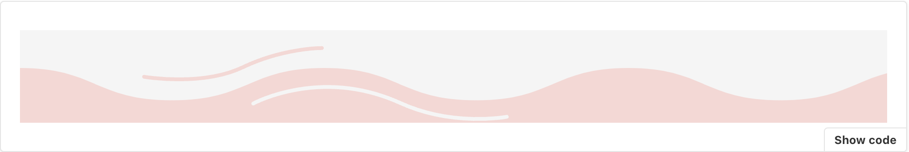

### 3.17 Gallery

Name of React component: `Gallery`
Location: `libs/ui/bratislava/src/components/Waves/Waves.tsx`
Screenshot:
// todo

